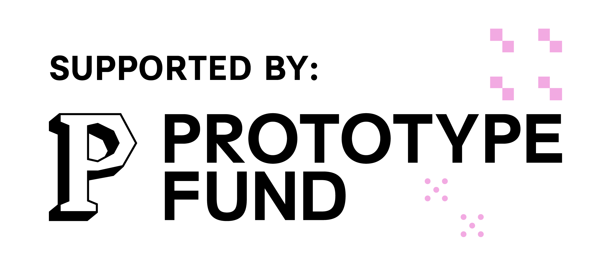

# Object Oriented Linked Data (OO-LD)

Open community to develop schemas and tools to link object oriented programming with linked data & the semantic web.

OO-LD (Object-Oriented Linked Data) is a unified framework that combines JSON Schema and JSON-LD to enable object-oriented linked data modeling without reinventing the wheel. By embedding JSON-LD contexts within JSON Schema documents, OO-LD allows for the simultaneous definition of data structure and semantics in a single source.

## Why OO-LD?

- **Standards-Based**: Strictly adheres to W3C standards (JSON-LD 1.1, JSON-SCHEMA 2020-12) - no new language to learn
- **Tool Compatibility**: Works with all existing JSON-SCHEMA and JSON-LD tooling
- **Web-Native**: Schemas follow linked data principles, making them retrievable over the web for flexible composition
- **Multi-Purpose**: Use the same schema for validation, RDF generation, code generation, UI generation, and API definitions
- **Developer-Friendly**: Compatible with LLM APIs, OpenAPI, and modern development workflows

## Quick Start

Here's a minimal OO-LD schema (`Person.schema.json`):

```json
{
  "@context": {
    "schema": "http://schema.org/",
    "name": "schema:name"
  },
  "$id": "Person.schema.json",
  "title": "Person",
  "type": "object",
  "properties": {
    "name": {
      "type": "string",
      "description": "First and Last name"
    }
  }
}
```

This file is simultaneously a **JSON Schema** (defines structure) and a **JSON-LD context** (provides semantics). Notice how `@context` maps the `name` property to `schema:name`, enabling both validation and RDF generation from the same source.

**Try it yourself:**
- UI and RDF generation: [OO-LD Playground](https://oo-ld.github.io/playground-yaml/) - Interactive examples with UI and RDF generation
- Code and RDF generation: [Python Playground](https://oo-ld.github.io/playground-python-yaml/) - Advanced examples with code generation
- [Full Tutorial](https://github.com/OO-LD/oold-tutorial) - Step-by-step guide with working examples

## Use Cases

- **Research Data Management**: OpenSemanticLab uses OO-LD for LIMS, ELN, and knowledge bases
- **API Development**: Generate OpenAPI specs with embedded semantic contexts
- **LLM Integration**: Use schemas directly for structured LLM output

## Resources

### Documentation
- [OO-LD Specification](https://github.com/OO-LD/schema) - Complete schema specification and examples

### Tools
- [oold-python](https://github.com/OO-LD/oold-python) - Python code generator and utilities
- [Playground (YAML)](https://oo-ld.github.io/playground-yaml/) - Interactive UI and RDF generation
- [Playground (Python)](https://oo-ld.github.io/playground-python-yaml/) - Try code generation online
- [AWL Schema](https://github.com/OO-LD/awl-schema) - Semantic workflow descriptions

### Reference Implementations
- [OpenSemanticLab](https://github.com/OpenSemanticLab) - Research data management framework
- [OpenSemanticWorld-Packages](https://github.com/OpenSemanticWorld-Packages) - Schema repository
- [OpenSemanticWorld](https://opensemantic.world) - Schema registry

### Related Projects
- [Battery Knowledge Graph](https://github.com/BIG-MAP/BatteryKnowledgeGraph) - Scientific metadata using OO-LD
- [OSW Chatbot](https://github.com/opensemanticworld/osw-chatbot) - LLM integration examples


### Get Involved
- [Report Issues](https://github.com/OO-LD/schema/issues)

---

**Start exploring**: Try the [interactive playground](https://oo-ld.github.io/playground-yaml/) or check out the [specification](https://github.com/OO-LD/schema).

---

## Funding

OO-LD is funded by the German **Federal Ministry of Research, Technology and
Space (BMFTR)** through the **[Prototype Fund](https://prototypefund.de)** under
funding code (Förderkennzeichen) **16IS26S16**.

<p>
  
  &nbsp;&nbsp;&nbsp;
  
</p>
