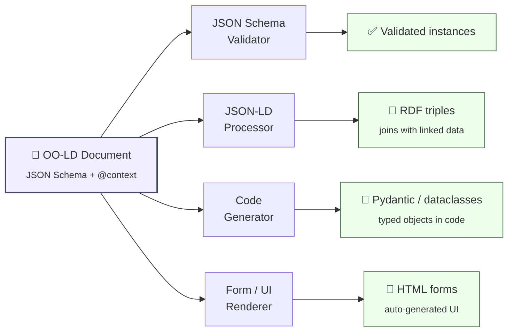

# Object-Oriented Linked Data (OO-LD)

Open community to develop schemas and tools to link object-oriented programming with linked data & the semantic web.

> **We don't reinvent standards - we compose them. OO-LD as a *composition* is what we're bringing into open 
> standardization.**

The abbreviation `OO-LD` (and the placement of the hyphen) is intentional: it highlights the object-oriented focus while echoing JSON-LD.

## Why OO-LD?

*The short version:*

- **One source, many outputs** - the same schema validates JSON data and generates RDF, code (e.g. Pydantic), 
  data-entry UIs, and OpenAPI specs.
- **Standards-aligned, not standards-locked** - every document is at once a valid [JSON Schema 2020-12]
  (https://json-schema.org/specification) and a valid [JSON-LD 1.1](https://www.w3.org/TR/json-ld11/) context; no fork, no new language.
- **Reuses the tooling you already have** - works with existing JSON Schema and JSON-LD libraries; OO-LD-specific 
  extensions are safely ignored by both.
- **Linked data without the learning curve** - web-retrievable, semantically interoperable schemas without first 
  becoming an RDF expert.

## The Problem

Modern applications need their data to do two jobs at once:

1. **Be valid** - does this document have the right shape and types?
2. **Mean something** - what real-world concept does each field actually refer to?

[JSON Schema](https://json-schema.org) solves (1). [JSON-LD](https://json-ld.org) solves (2).
Today, teams who need both maintain two parallel files that drift apart - and JSON-LD
assumes a level of semantic-web expertise that most application developers don't have.

**OO-LD merges both into a single, referenceable, versioned document** so one source
describes *shape* and *meaning* together. Object-oriented developers get interoperable
linked data without first having to become RDF experts.

<details>
<summary><b>What is JSON Schema?</b></summary>

A widely-used standard for describing the structure of JSON documents - which fields
exist, their types, which are required, and how they nest. Used by OpenAPI, form
generators, and most modern validation libraries.
Spec: [json-schema.org](https://json-schema.org/specification) (Draft 2020-12)
</details>

<details>
<summary><b>What is JSON-LD?</b></summary>

A W3C standard that adds semantic meaning to JSON by mapping each field to a globally
unique identifier (an IRI). A JSON-LD document can be losslessly converted to RDF
triples and joined with other linked data on the web.
Spec: [www.w3.org/TR/json-ld11](https://www.w3.org/TR/json-ld11/)
</details>

<details>
<summary><b>What is Linked Data / RDF?</b></summary>

Linked Data is the practice of identifying things with web URLs so data from different
sources can be joined. RDF (Resource Description Framework) is the underlying data
model - every fact is a *triple* of `(subject, predicate, object)`. Together they make
data interoperable across organizations and tools.
Intro: [www.w3.org/wiki/LinkedData](https://www.w3.org/wiki/LinkedData)
</details>

## How it works

An OO-LD document is a JSON Schema with an embedded `@context`. The mechanism is
surprisingly simple:

- **JSON Schema validators** ignore unknown top-level keys, including `@context`.
- **JSON-LD processors** ignore keys they don't recognize, including `properties`,
  `type: "object"`, `required`, and so on.

The same file passes through both toolchains, each seeing only what it cares about.
One document becomes the source of truth for validation, semantics, code, and UI:


```mermaid
flowchart LR
    Doc["📄 OO-LD Document<br/><sub>JSON Schema + @context</sub>"]

    Doc --> V["JSON Schema<br/>Validator"]
    Doc --> J["JSON-LD<br/>Processor"]
    Doc --> C["Code<br/>Generator"]
    Doc --> U["Form / UI<br/>Renderer"]

    V --> V1["✅ Validated instances"]
    J --> J1["🔗 RDF triples<br/><sub>joins with linked data</sub>"]
    C --> C1["🐍 Pydantic / dataclasses<br/><sub>typed objects in code</sub>"]
    U --> U1["📝 HTML forms<br/><sub>auto-generated UI</sub>"]

    classDef doc fill:#eef,stroke:#446,stroke-width:2px;
    classDef out fill:#efe,stroke:#464;
    class Doc doc;
    class V1,J1,C1,U1 out;
```

| Output | Produced by | From which part of the document |
|---|---|---|
| Validated instances | JSON Schema validator | `type`, `properties`, `required`, … |
| RDF triples | JSON-LD processor | `@context` + matching data instance |
| Generated code (Pydantic, dataclasses) | OO-LD code generator | full schema + context |
| Generated forms / UI | JSON-Schema form renderer | `properties`, `title`, `description` |

> **One important inversion from standard JSON-LD:** in OO-LD, `@context` lives in the
> **schema**, not in each data document. Every instance validated against an OO-LD
> schema simply references it (`"@context": "https://example.com/MySchema.schema.json"`) and inherits all
> semantics automatically - instances stay as plain JSON, with no per-document mapping
> boilerplate.

<details>
<summary><b>What is <code>@context</code>?</b></summary>

A JSON-LD construct that maps short JSON keys (e.g. <code>name</code>) to globally
unique identifiers (e.g. <code>http://schema.org/name</code>). It's how a JSON document
gains semantic meaning without changing how the data itself looks. See the inversion
note above for how OO-LD places it in the schema rather than the data instance.
</details>

<details>
<summary><b>Why doesn't this break either standard?</b></summary>

Both specs are deliberately permissive about unknown keywords:

- JSON Schema 2020-12 §6.5: unknown keywords are not errors; validators MUST ignore
  them unless they opt in via vocabularies.
- JSON-LD 1.1 §4.4: terms not defined in the active context are dropped during
  expansion, not flagged as errors.

OO-LD lives in the intersection where each spec is silent about the other's vocabulary.
No spec changes are required.
</details>

<details>
<summary><b>What does "Object-Oriented" mean here?</b></summary>

OO-LD schemas can extend, compose, and specialize each other using standard JSON Schema
mechanisms (<code>$ref</code>, <code>allOf</code>) that line up with RDF class
hierarchies. An <code>Employee</code> schema can inherit from <code>Person</code>, and
both structural and semantic definitions are inherited together. See the
<a href="#inheritance-and-composition">Inheritance and Composition</a> example below.
</details>

## Minimal Example

Here's the smallest possible OO-LD schema (`Person.schema.json`):

```json
{
  "@context": {
    "schema": "http://schema.org/",
    "name": "schema:name"
  },
  "$id": "https://example.com/Person.schema.json",
  "title": "Person",
  "type": "object",
  "properties": {
    "name": {
      "type": "string",
      "description": "First and Last name"
    }
  }
}
```

This file is simultaneously a **JSON Schema** (defines structure) and a **JSON-LD context** (provides semantics). Notice how `@context` maps the `name` property to `schema:name`, enabling both validation and RDF generation from the same source.

## Try it yourself

- UI and RDF generation: [OO-LD Playground](https://oo-ld.github.io/playground-yaml/) - Interactive examples with UI 
  and RDF generation
- Code and RDF generation: [Python Playground](https://oo-ld.github.io/playground-python-yaml/) - Advanced examples 
  with code generation
- [Full Tutorial](https://github.com/OO-LD/oold-tutorial) - Step-by-step guide with working examples

## Inheritance and Composition

OO-LD schemas extend each other using standard JSON Schema mechanisms (`$ref`, `allOf`),
and the semantic mappings stack automatically. Here's `Person` extended into `Employee`.

**Base schema - `Person.schema.json`:**

```json
{
  "@context": {
    "schema": "http://schema.org/",
    "name": "schema:name"
  },
  "$id": "https://example.com/Person.schema.json",
  "title": "Person",
  "type": "object",
  "properties": {
    "name": {
      "type": "string",
      "description": "First and Last name"
    }
  }
}
```

**Derived schema - `Employee.schema.json`:**

```json
{
  "@context": [
    "https://example.com/Person.schema.json",
    {
      "schema": "http://schema.org/",
      "jobTitle": "schema:jobTitle",
      "employer": {
        "@id": "schema:worksFor",
        "@type": "@id"
      }
    }
  ],
  "$id": "https://example.com/Employee.schema.json",
  "title": "Employee",
  "type": "object",
  "allOf": [
    { "$ref": "https://example.com/Person.schema.json" }
  ],
  "properties": {
    "jobTitle": {
      "type": "string",
      "description": "Job title"
    },
    "employer": {
      "type": "string",
      "format": "iri",
      "description": "IRI of the employing organization"
    }
  },
  "required": ["jobTitle"]
}
```

Two inheritance mechanisms work in parallel:

| Layer | Mechanism | Effect |
|---|---|---|
| **Structure** (JSON Schema) | `allOf` + `$ref` to parent schema | Employee must satisfy all of Person's constraints plus its own |
| **Semantics** (JSON-LD) | `@context` array referencing parent schema | Employee inherits Person's term mappings, then adds its own |

**A data instance - `alice.json`:**

```json
{
  "@context": "https://example.com/Employee.schema.json",
  "$schema": "https://example.com/Employee.schema.json",
  "name": "Alice",
  "jobTitle": "Engineer",
  "employer": "https://example.com/companies/acme"
}
```

Instances stay as plain JSON. They reference the schema once - via both `@context`
(for semantics) and `$schema` (for validation) - and inherit everything from it.
No per-instance `@type`, no `@id` boilerplate required.

This single instance simultaneously:

**1. Validates against both schemas.** Person's constraint (`name` as string) and
Employee's (`jobTitle` required, `employer` as IRI) all check out.

**2. Expands to RDF triples** via the inherited `@context`:

```turtle
@prefix schema: <http://schema.org/> .

_:b0 schema:name "Alice" ;
     schema:jobTitle "Engineer" ;
     schema:worksFor <https://example.com/companies/acme> .
```

**3. Generates a Python class hierarchy** that mirrors the schema inheritance:

```python
# Generated by oold-python
from pydantic import BaseModel, ConfigDict
from typing import Optional

class Person(BaseModel):
    model_config = ConfigDict(
        json_schema_extra={
            "@context": {
                "schema": "http://schema.org/",
                "name": "schema:name"
            }
        }
    )
    name: Optional[str] = None
    """First and Last name"""


class Employee(Person):                          # ← real subclass, not flat duplication
    model_config = ConfigDict(
        json_schema_extra={
            "@context": [
                "https://example.com/Person.schema.json",
                {
                    "schema": "http://schema.org/",
                    "jobTitle": "schema:jobTitle",
                    "employer": {
                        "@id": "schema:worksFor",
                        "@type": "@id"
                    }
                }
            ]
        }
    )
    jobTitle: str
    """Job title"""
    employer: Optional[str] = None
    """IRI of the employing organization"""
```

<details>
<summary><b>How does <code>@context</code> inheritance work?</b></summary>

JSON-LD 1.1 allows <code>@context</code> to be an <em>array</em>. Each entry is merged
left-to-right, with later entries overriding earlier ones. When an entry is a string
URL, the JSON-LD processor fetches that document and merges its <code>@context</code>.

Because every OO-LD schema embeds its <code>@context</code> at the top level, pointing
at <code>Person.schema.json</code> from inside <code>Employee.schema.json</code> pulls
in Person's term mappings before Employee's own are applied.

Spec: <a href="https://www.w3.org/TR/json-ld11/#advanced-context-usage">JSON-LD 1.1 §4.1 Advanced Context Usage</a>
</details>

<details>
<summary><b>How does JSON Schema inheritance work?</b></summary>

<code>allOf</code> requires the instance to validate against every schema in its array.
Combined with <code>$ref</code>, it's the standard JSON Schema idiom for "this schema
extends that one":

<pre>"allOf": [{ "$ref": "https://example.com/Person.schema.json" }]</pre>

JSON Schema doesn't have a dedicated <code>extends</code> keyword - <code>allOf + $ref</code>
is the convention OpenAPI, Pydantic, and most code generators recognize as inheritance.

Spec: <a href="https://json-schema.org/draft/2020-12/json-schema-core.html#name-allof">JSON Schema 2020-12 §10.2.1.1 allOf</a>
</details>

## Versioning & Identity

Because the meaning of each field lives in the **schema**, an instance references a
*versioned* schema URL - pinning exactly which schema version, and therefore which ontology
mapping, it complies with. You can remap terms or fix a semantic binding in a new schema
version **without rewriting existing data**; migration tooling handles the upgrade.

<details>
<summary><b>How versioning &amp; identity work</b></summary>

- Every schema has a stable, resolvable <code>$id</code> and SHOULD carry an
  <code>x-oold-uuid</code> (a UUID that identifies the schema across renames) and an
  <code>x-oold-version</code> (SemVer).
- Instances reference a versioned schema URL via both <code>@context</code> and
  <code>$schema</code> - e.g. <code>https://example.com/my-package/1.0.0/Person.schema.json</code>.
- Schemas can declare compatibility explicitly with <code>x-oold-prior-version</code>,
  <code>backward-compatible-with</code>, and <code>incompatible-with</code>.
- This is why instances carry no inline <code>@type</code> or ontology IRIs: the versioned
  schema owns the semantic mapping, so data stays stable while the mapping can evolve.

Spec: <a href="https://github.com/OO-LD/schema#versioning">OO-LD Versioning</a>
</details>

## Use Cases

OO-LD targets teams who need interoperable, semantically meaningful data **without a
dedicated semantic-web specialist on staff** - from application developers to research labs
to public administration. One schema serves validation, RDF, code, and UI at once:

- **LLM-Structured Output** - JSON Schema is the contract LLMs use for structured
  generation. Because an OO-LD schema *is* a JSON Schema, you can hand it directly to LLM
  APIs and frameworks like [LangChain](https://python.langchain.com/docs/how_to/structured_output/)
  - and get back data that is both validated *and* semantically annotated, ready for RDF
  or a knowledge graph.
- **APIs & Code Generation** - Generate typed classes ([Pydantic](https://docs.pydantic.dev/)
  dataclasses) and [OpenAPI](https://www.openapis.org/) specifications from the same schema,
  with semantic context preserved through the whole stack (e.g. via [FastAPI](https://fastapi.tiangolo.com/)).
- **Auto-generated User Interfaces** - Render data-entry forms and graph editors straight
  from the schema - no hand-written UI code - including autocomplete dropdowns backed by
  linked-data sources.
- **Research Data Management** - Describe experiments, samples, and instruments once and
  get validation, RDF export, and data-entry forms together. [OpenSemanticLab](https://github.com/OpenSemanticLab)
  builds its LIMS, ELN, and knowledge-base platform on OO-LD, integrating with research-data
  infrastructures such as [NFDI](https://www.nfdi.de/).
- **Public Administration & Civic-Tech** - Build interoperable data structures that carry
  their meaning with them, making linked-data interoperability practical for teams that
  aren't RDF experts.

## How OO-LD compares

OO-LD's core bet: **don't invent a new language - compose two standards developers may
already use.** Here's how that compares to the common alternatives:

| Approach | Validates plain JSON | Linked-data / RDF semantics | New language to learn | Reuses existing tooling |
|---|---|---|---|---|
| **OO-LD** | ✅ | ✅ | ❌ | ✅ JSON Schema *and* JSON-LD tools |
| JSON Schema alone | ✅ | ❌ | ❌ | ✅ |
| JSON-LD alone | ❌ (no structural rules) | ✅ | ❌ | ✅ |
| [LinkML](https://linkml.io/) | ✅ via generated JSON Schema | ✅ via generated context | ✅ custom YAML language | Own toolchain + generators |
| [SHACL](https://www.w3.org/TR/shacl/) / [OWL](https://www.w3.org/TR/owl2-overview/) | ❌ RDF only | ✅ | ✅ | RDF tooling only |

**When another tool may fit better:**

- **Formal reasoning / inference** over your data → [OWL](https://www.w3.org/TR/owl2-overview/)
- **Validating data that's already RDF-native** → [SHACL](https://www.w3.org/TR/shacl/)
- **A high-level modeling language with many export targets** → [LinkML](https://linkml.io/) -
  which can itself *generate* OO-LD schemas (JSON Schema + JSON-LD context), so the two are
  complementary rather than exclusive.

For the full landscape (AAS, SAMM, TreeLDR, SmartDataModels, dlite, NOMAD, and more), see the
[Related Work table in the specification](https://github.com/OO-LD/schema#related-work).

## Project Status & Roadmap

OO-LD is **stabilizing toward a 1.0 specification.** The core approach is already proven in
production by [OpenSemanticLab](https://github.com/OpenSemanticLab) and several
proof-of-concept implementations; current work hardens both the specification and the Python
reference implementation. Everything is open source
([Apache-2.0](https://www.apache.org/licenses/LICENSE-2.0)) and versioned with
[SemVer](https://semver.org/).

**✅ Available today**
- The OO-LD schema pattern on JSON Schema 2020-12 + JSON-LD 1.1
- Python library (prototype): code generation, RDF import/export, graph-object binding
- Interactive playgrounds for UI, RDF, and Python code generation
- In production use within OpenSemanticLab

**🚧 In progress - toward v1.0**
- Finalized OO-LD 1.0 specification with documented best practices
- Production-ready Python reference implementation (stable API, >90% test coverage)
- Offline schema bundler
- Schema and meta-schema validation
- LLM structured-output integration for common frameworks
- Schema-versioning and migration tooling
- Automated form / UI generation and a graph viewer

**📋 Planned - sustainability & governance**
- Community structure with a steering committee
- Package registry for community-contributed schemas
- Tutorial video series and webinars
- Submission to a [W3C Community Group](https://www.w3.org/community/) for open standardization

## Resources

### Start here - which tool for which job

| You want to… | Go to                                                                                                                        |
|---|------------------------------------------------------------------------------------------------------------------------------|
| **Try OO-LD in your browser** (UI + RDF from a schema) | [Playground (YAML)](https://oo-ld.github.io/playground-yaml/)                                                                |
| **Generate code** (Python / Pydantic) from a schema | [Playground (Python)](https://oo-ld.github.io/playground-python-yaml/) · [oold-python](https://github.com/OO-LD/oold-python) |
| **Use OO-LD in a Python project** (codegen, RDF import/export, graph-object binding) | [oold-python](https://github.com/OO-LD/oold-python)                                                                          |
| **Auto-generate data-entry forms / UI** | [Playground (YAML)](https://oo-ld.github.io/playground-yaml/)                                                                |
| **Visualize or edit a semantic graph** | [interactive-semantic-graph](https://github.com/OpenSemanticLab/interactive-semantic-graph)                                  |
| **Use schemas for LLM structured output** | Hand the schema to your LLM API - example: [OSW Chatbot]<br/>(https://github.com/opensemanticworld/osw-chatbot)              |
| **Describe semantic workflows** | [AWL Schema](https://github.com/OO-LD/awl-schema) · [AWL Playground](https://oo-ld.github.io/playground-awl/)                |
| **Run a full data-management platform** | [OpenSemanticLab](https://github.com/OpenSemanticLab)                                                                        |
| **Read the formal specification** | [OO-LD Specification](https://github.com/OO-LD/schema)                                                                       |

### Documentation
- [OO-LD Specification](https://github.com/OO-LD/schema) - Complete schema specification and examples

### Tools
- [oold-python](https://github.com/OO-LD/oold-python) - Python code generator and utilities
- [Playground (YAML)](https://oo-ld.github.io/playground-yaml/) - Interactive UI and RDF generation
- [Playground (Python)](https://oo-ld.github.io/playground-python-yaml/) - Try code generation online
- [AWL Schema](https://github.com/OO-LD/awl-schema) - Semantic workflow descriptions

### Reference Implementations
- [OpenSemanticLab](https://github.com/OpenSemanticLab) - Research data management framework
- [OpenSemanticWorld-Packages](https://github.com/OpenSemanticWorld-Packages) - Schema repository
- [OpenSemanticWorld](https://opensemantic.world) - Schema registry

### Related Projects
- [Battery Knowledge Graph](https://github.com/BIG-MAP/BatteryKnowledgeGraph) - Scientific metadata using OO-LD
- [OSW Chatbot](https://github.com/opensemanticworld/osw-chatbot) - LLM integration examples


### Get Involved
- [Report Issues](https://github.com/OO-LD/schema/issues)

---

## Funding

The **generic, domain-independent** OO-LD framework - the specification and its reference
implementation - is funded by the German **Federal Ministry of Research, Technology and
Space (BMFTR)** through the **[Prototype Fund](https://prototypefund.de)** (funding code /
Förderkennzeichen **16IS26S16**).

<p>
  
  &nbsp;&nbsp;&nbsp;
  
</p>

The **application of OO-LD to materials science** is funded by the European Union’s **Horizon Europe** research and
innovation programme under grant agreement No. 101293545 (MaterialsCommons). This grant covers
a domain-specific extension only.
<p>
  
  &nbsp;&nbsp;&nbsp;
  
</p>
